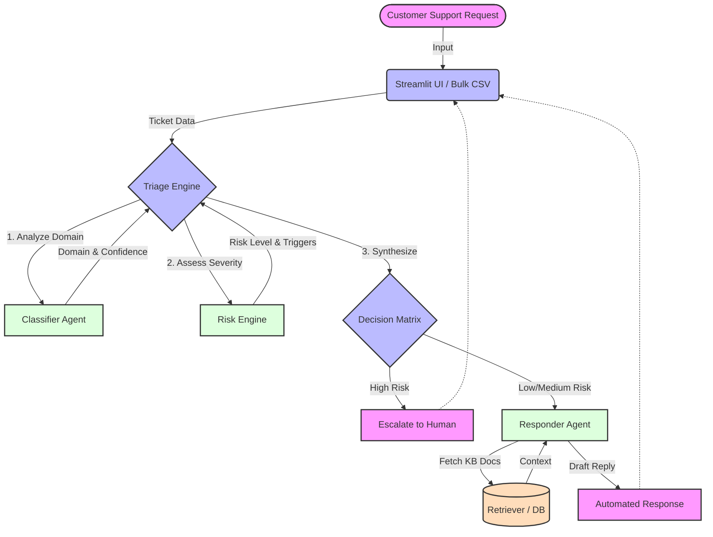

<div align="center">
  
  
  <h1>🧠 CortexDesk Intelligence Engine</h1>
  
  <p><strong>A Production-Grade, Context-Aware Support Triage Platform</strong></p>

  [](https://github.com/yourusername/CortexDesk)
  [](https://www.python.org/)
  [](https://streamlit.io/)
  [](CONTRIBUTING.md)

</div>

---

## 🌟 Overview

**CortexDesk** is an advanced AI-powered intelligence engine designed to transform basic support ticketing into a proactive, risk-aware, and highly efficient workflow. Moving beyond simple rule-based triage, CortexDesk acts as a sophisticated gatekeeper that analyzes incoming user queries, identifies underlying risks (like fraud or account compromise), and executes a multi-tier decision matrix.

### ⚠️ Project Status
> **Current Stage:** **Working Stage** 🛠️
> This project is currently in active development but is fully functional! We are refining the risk models and expanding the decision matrix. If you want to contribute, we would love your help! (See [Contributing](#-contributing) section below).

---

## ✨ Key Features

- **🛡️ Weighted Risk-Detection Engine:** Accurately identifies security-sensitive issues, assessing the severity of the user's situation.
- **🔀 Multi-Tier Decision Matrix:** Dynamically responds or escalates to human agents based on computed risk levels and confidence scores.
- **💬 Context-Aware Responses:** Generates tailored support replies with an appropriate tone (e.g., urgent for security incidents, empathetic for general issues).
- **🔍 Explainable AI (XAI) Triggers:** Provides high-fidelity explainability by highlighting the exact keywords and behavioral triggers detected in the user input.
- **📊 Interactive Dashboard:** A beautiful Streamlit-based UI to monitor ticket analytics, domain distribution, and escalation rates.

---

## 🏗️ System Architecture

CortexDesk employs a multi-agent architecture where distinct specialized modules handle classification, risk assessment, and response generation before making a final triage decision.



---

## 🚀 Getting Started

### Prerequisites

- Python 3.8+
- Active API Keys for the configured LLM models (OpenAI, Anthropic, etc. depending on your `.env` configuration)

### Installation

1. **Clone the repository:**
   ```bash
   git clone https://github.com/yourusername/CortexDesk.git
   cd CortexDesk
   ```

2. **Install dependencies:**
   ```bash
   pip install -r requirements.txt
   ```
   *(If `requirements.txt` is missing, ensure you have `streamlit`, `pandas`, `scikit-learn`, and your LLM provider SDKs installed).*

3. **Configure Environment Variables:**
   Create a `.env` file in the root directory and add your API keys:
   ```env
   # Add necessary API keys here
   OPENAI_API_KEY=your_key_here
   ```

### Running the Application

To launch the CortexDesk interactive web interface:

```bash
streamlit run app.py
```

To run a bulk processing job on a CSV file of tickets:

```bash
python main.py
```

---

## 📸 Screenshots


### App UI


---

## 🤝 Contributing

**We welcome contributions!** 

Since CortexDesk is currently in the **working stage**, there are many areas where you can help make an impact:
- 🧠 Enhancing the `risk_engine.py` heuristics and prompts.
- 🎨 Improving the Streamlit UI components.
- 📚 Expanding the automated retriever's knowledge base.
- 🐛 Bug hunting and writing unit tests.

### How to Contribute:
1. **Fork** the repository.
2. **Create a new branch** (`git checkout -b feature/AmazingFeature`).
3. **Commit your changes** (`git commit -m 'Add some AmazingFeature'`).
4. **Push to the branch** (`git push origin feature/AmazingFeature`).
5. **Open a Pull Request**.

Please feel free to open an issue to discuss what you would like to change!

---

<div align="center">
  <p>Built with ❤️ by the CortexDesk Team.</p>
</div>
